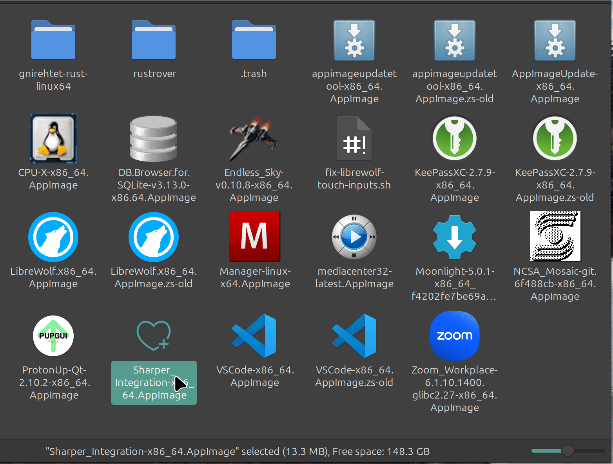

# Sharper Integration


Sharper Integration is an AppImage desktop integration program that aims for simple integration via established Linux desktop conventions.

Its features include:

- Extracts and integrates the desktop icon and desktop file from the AppImage and integrates them with the desktop.
- Registers App Images with their associated mime-types.
- Upon installation of itself, associates itself with the AppImage mime-type.
- Adds options to undo desktop integration and to update the AppImage from the menu (using AppImageUpdate or appimageupdatetool if present in the same directory as SharperIntegration).

Sharper Integration is primarily written in C#.

## Try it out

Download SharperIntegration from [here](https://github.com/namehillsoftware/sharper-app-images/releases) and [make it executable](https://discourse.appimage.org/t/how-to-make-an-appimage-executable/). Then execute the AppImage, it should prompt you to install itself.



### Firejail Support

[Firejail](https://github.com/netblue30/firejail) runs AppImages within special namespaces isolated from the rest of the system.
This means Sharper Integration will be prevented performing its Desktop Integration functions when run within Firejail without broader permissions granted to Sharper Integration.

# Motivation

## User Story

- As a user, I want to be able to right-click on a program and integrate it into my desktop environment, so that I can launch it via my normal desktop conventions.

## Specification

- Correct Icon must be extracted and used.
- Correct desktop file must be extracted and used, desktop file should remain the same.
- Integration must be reversible.
- Desktop file should have the option to update (if AppImageUpdate or appimageupdatetool are on the path).
  - If AppImageUpdate is on the path, then that should be launched, otherwise appimageupdatetool should be used if it is on the path.

# Alternatives

## AppImageLauncher

###  Pros

- Seamlessly integrates AppImages on launch of an AppImage.
- The desktop entry has a sane format and name.

### Cons

- Some apps can't run?!
- Some apps seem to crash!?
- Doesn't seem to follow appimageupdate conventions.

## GoAppImage

### Pros

- Integrates as an appimage.
- Runs as a user space service.

### Cons

- Apps are automatically removed for seemingly no reason (usually related to the PATH changing).

# Contributing

## Building

[dotnet SDK 8](https://dotnet.microsoft.com/en-us/download/dotnet/8.0) or greater is required to build SharperIntegration
within your normal operating environment.

To build and package SharperIntegration as an AppImage, Docker is required. Once Docker is installed, run the following
command:

```sh
./build.sh
```

An AppImage should be produced in the `./_out` directory.

## Versioning

[SemVer](http://semver.org/) is used for versioning. For the published versions, see the [tags in this repository](https://github.com/namehillsoftware/projectBlue/tags).

## Authors

- [David Vedvick](https://davidvedvick.info)

## License

This project is licensed under the GNU Lesser General Public License v3.0 - see the [LICENSE](LICENSE) file for details.

## Development Resources

- [XDG Desktop Entry Specification](https://xdg.pages.freedesktop.org/xdg-specs/desktop-entry-spec/latest/index.html#introduction)
- [AppImageKit](https://github.com/AppImage/AppImageKit)
- [Awesome AppImage](https://github.com/AppImageCommunity/awesome-appimage?tab=readme-ov-file)
- Dialogs are displayed using either [Zenity](https://help.gnome.org/users/zenity/stable/) or [KDialog](https://develop.kde.org/docs/administration/kdialog/)
- Numerous wonderful C# packages:
	- [SharperIntegration](./SharperIntegration/SharperIntegration.csproj)
	- [SharperIntegration.Test](./SharperIntegration.Test/SharperIntegration.Test.csproj)
